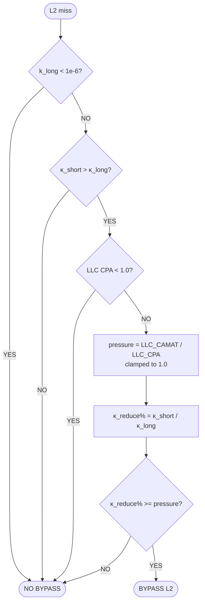
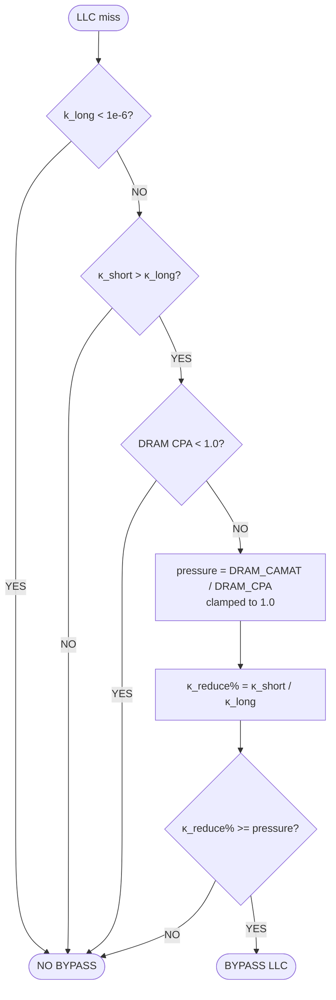
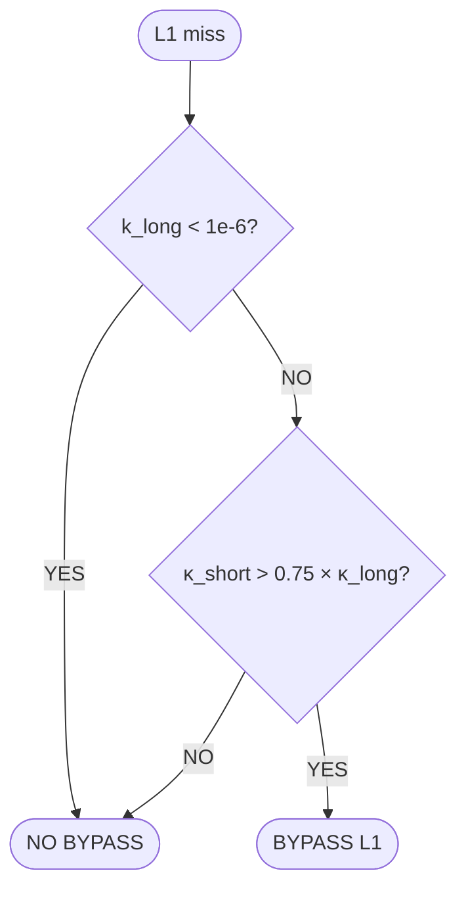
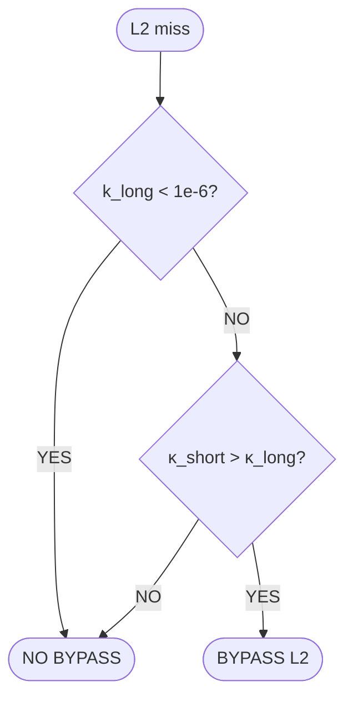
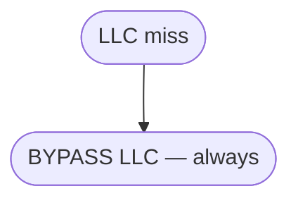
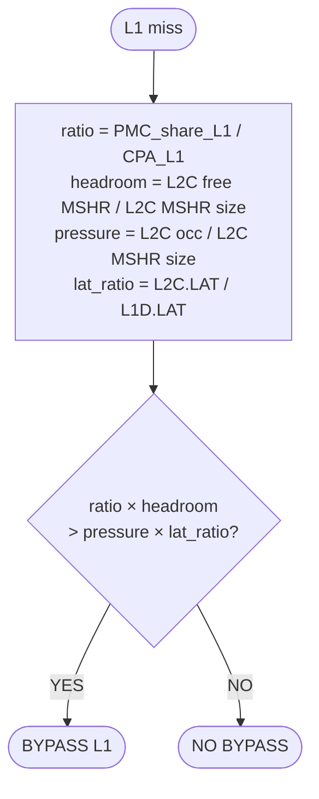
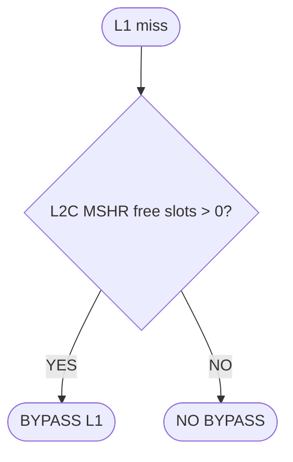
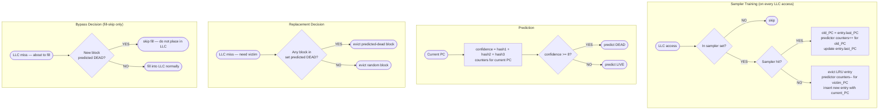

```mermaid
flowchart TD
    subgraph DECISION["Bypass Decision"]
        D1([L1d miss]) --> D2{PC in CIT?}
        D2 -- NO --> D4([BYPASS])
        D2 -- YES --> D3{counter >= threshold?}
        D3 -- YES --> D5([REGULAR ACCESS])
        D3 -- NO --> D4
    end

    subgraph BYPASS_PATH["Bypass Execution"]
        B1([BYPASS]) --> B2[Send parallel:\nL2 request + NTB request]
        B2 --> B3{NTB hit?}
        B3 -- YES --> B4([serve from NTB])
        B3 -- NO --> B5{L2 hit?}
        B5 -- YES --> B6([serve from L2])
        B5 -- NO --> B7{L3 hit?}
        B7 -- YES --> B8([update NTB repl state\nserve from L3])
        B7 -- NO --> B9[DRAM fetch\nfill into NTB\ndelete cache MSHRs]
        B9 --> B10([serve from NTB])
    end

    subgraph TRAINING["CIT Training (on every L1d miss)"]
        TR1([L1d miss]) --> TR2{Address in AHT?}
        TR2 -- YES --> TR3[CIT current_PC ++\nCIT original_PC ++]
        TR2 -- NO --> TR4[insert addr+PC into AHT]
        TR4 --> TR5{PC in CIT?}
        TR5 -- NO --> TR6[init CIT entry above threshold]
        TR4 --> TR7[on AHT eviction:\nCIT evicted_PC --]
    end
```

# Bypass Model Flowcharts — SOTA + Paper Comparisons

---

## Model 520a — κ-Reduce + CAMATpressure

Bypass IFF κ_short > κ_long **AND** κ_reduce% ≥ next-level C-AMAT/CPA pressure. Same 2-gate structure at all three levels; only the pressure source changes (L2 → LLC → DRAM).

### L1 Bypass (pressure source: L2C C-AMAT/CPA)


### L2 Bypass (pressure source: LLC C-AMAT/CPA)



### LLC Bypass (pressure source: DRAM C-AMAT/CPA)



---

## Model 530 — ByPw κ-threshold (L1=0.75, L2=1.0, LLC=always)

Simple κ-ratio threshold per level, LLC unconditional. Baseline for comparing pressure-gated variants.

### L1 Bypass (threshold: 0.75)



### L2 Bypass (threshold: 1.0)



### LLC Bypass (unconditional)



---

## Model 1100 — PMCHeadroom

PMC-share weighted by next-level headroom vs pressure×latency ratio. Operates independently at L1 and LLC.

### L1 Bypass



### LLC Bypass

```mermaid
flowchart TD
    A([LLC miss]) --> B[ratio = PMC_share_LLC / CPA_LLC\ndram_pressure = pure_miss_cy / omega_dram_cy\nclamped to 1.0\nocc_self = LLC MSHR occ / LLC MSHR size]
    B --> C{ratio × (1 − dram_pressure)\n> occ_self?}
    C -- YES --> Y([BYPASS LLC])
    C -- NO --> Z([NO BYPASS])
```

---

## Model 1000 — AdaptiveAlways

Trivial gate: bypass L1 whenever L2C MSHR has any free slot.

### L1 Bypass



---

## Paper: SDBP — Sampling Dead Block Predictor (MICRO 2010)

Fill-skip bypass only (no MSHR skip). Prediction indexed by last-access PC via skewed 3-table predictor trained on sampled sets.

### Original text flowchart

```
(START: LLC access — miss or hit)
  =>
<access in sampler set?>
  => YES =>
    <sampler hit?>
      => YES =>
        [old_PC = sampler_entry.last_PC]
        /predictor[hash1(old_PC)].counter++/  (old PC led to reuse — less dead)
        /predictor[hash2(old_PC)].counter++/
        /predictor[hash3(old_PC)].counter++/
        [sampler_entry.last_PC = current_PC]
      => NO (sampler miss) =>
        [evict LRU sampler entry]
        [victim_PC = evicted_entry.last_PC]
        /predictor[hash1(victim_PC)].counter--/  (victim PC led to dead block)
        /predictor[hash2(victim_PC)].counter--/
        /predictor[hash3(victim_PC)].counter--/
        [insert new entry: last_PC = current_PC, prediction bit]
  => NO => (skip sampler update)
  =>
[confidence = predictor[hash1(PC)] + predictor[hash2(PC)] + predictor[hash3(PC)]]
  =>
<confidence >= threshold (8)?>
  => YES => [predict DEAD]
  => NO  => [predict LIVE]

--- REPLACEMENT DECISION ---
(START: LLC miss, need victim)
  =>
<any block in set predicted DEAD?>
  => YES => [evict predicted-dead block]
  => NO  => [evict random block]

--- BYPASS DECISION ---
(START: LLC miss, about to fill)
  =>
<new block predicted DEAD on arrival?>
  => YES => [do NOT place in cache — bypass fill]
  => NO  => [place in cache normally]
```

### Mermaid flowchart



---

## Paper: HBPB — History-Based Preemptive Bypassing (SBAC-PAD 2022)

Assumes unfriendly by default; CIT counter must exceed threshold to allow caching. Uses parallel NTB path; does NOT skip MSHR — instead deletes MSHR entries after resolution.

### Original text flowchart

```
(START: L1d new miss)
  =>
[send access info to HBPB]
  =>
<PC in CIT?>
  => YES => <counter >= threshold?>
    => YES => [do not bypass] => (REGULAR ACCESS)
    => NO  => [bypass]
  => NO => [bypass]  (default: assume not cache-friendly)
  =>
[BYPASS PATH:]
[send parallel request to L2] + [send request to NTB]
  =>
<NTB hit?>
  => HIT => [serve from NTB to core LSQ] => (END)
  => MISS =>
    <L2 hit?>
      => HIT => [serve from L2] => (END)
      => MISS =>
        <L3 hit?>
          => HIT => /update NTB replacement state/ => (END)
          => MISS =>
            [request DRAM, fill into NTB]
            [remove MSHR entries on caches]
            => (END)

--- TRAINING (on every access) ---
(START: L1d new miss)
  =>
<address in AHT?>
  => YES => [reused — CIT[current_PC]++ AND CIT[original_PC]++]
  => NO =>
    [insert address+PC into AHT]
    <PC in CIT?>
      => NO => [CIT[PC] = counter above threshold]  (new entry = cache-friendly)
    [on AHT eviction: CIT[evicted_PC]--]
```

### Mermaid flowchart


